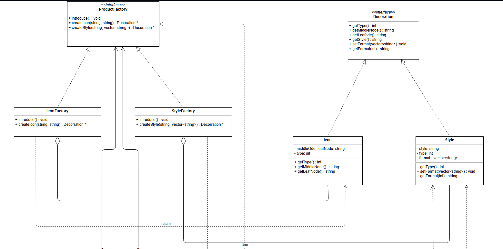
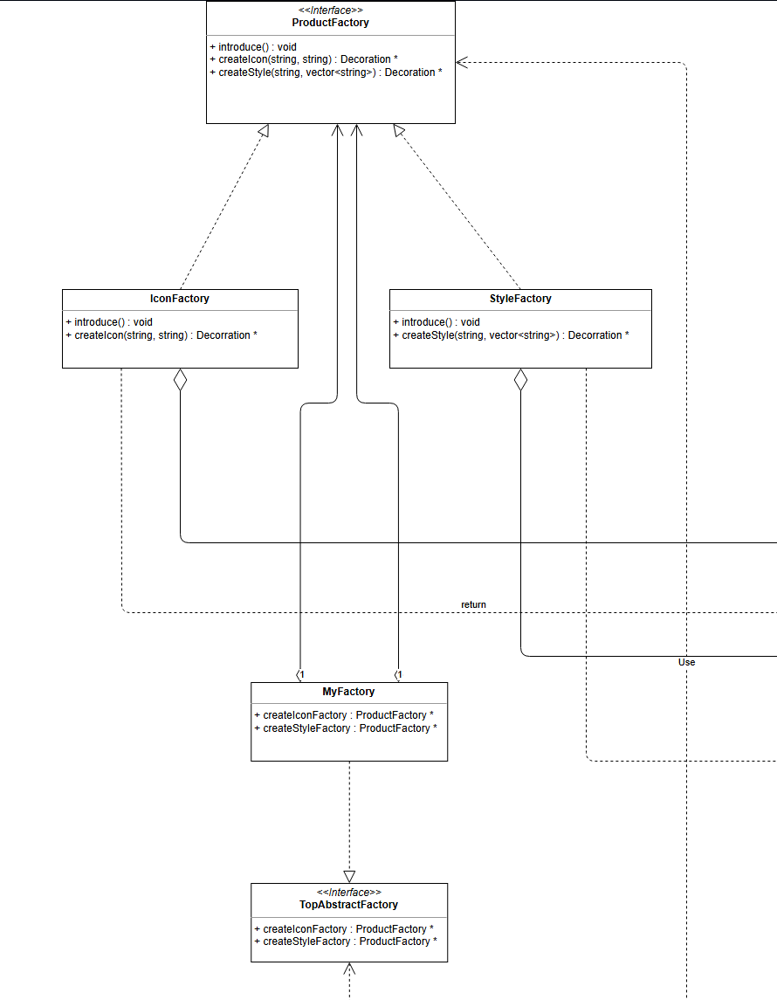
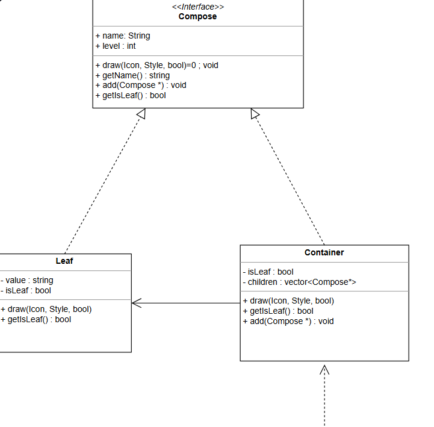
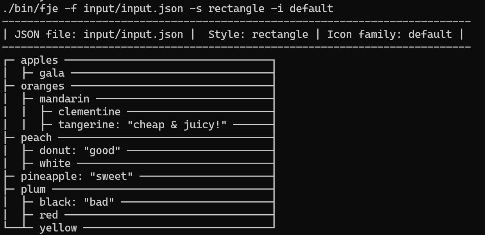
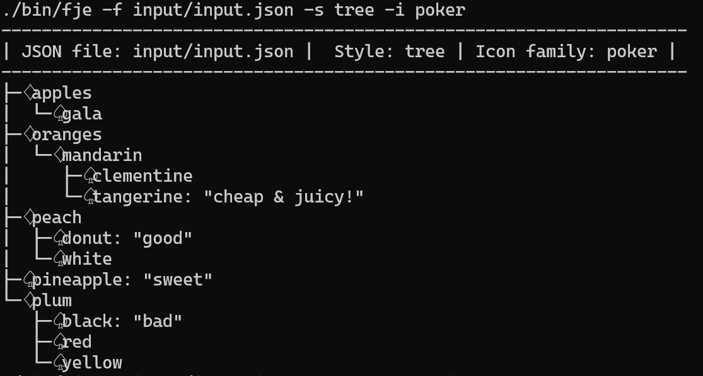
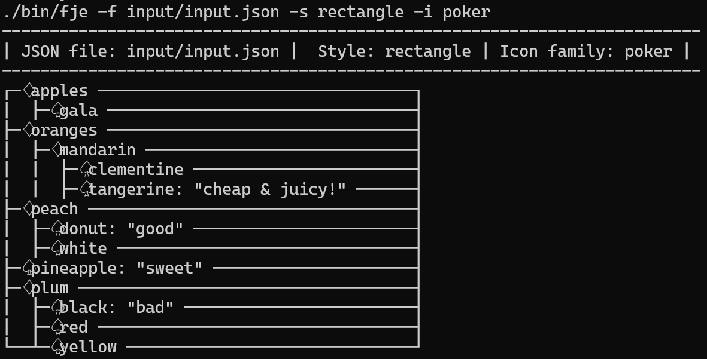

# 软件工程作业-Funny JSON Explorer

计科（系统结构）21307207 蔡俊彦

## 实验过程

### 运行环境

Ubuntu22.04

### 类图


### 设计模式说明

#### 工厂方法

工厂方法（Factory Method）是一种创建型设计模式，它定义了一个创建对象的接口，但由子类决定要实例化的类是哪一个。工厂方法使得一个类的实例化延迟到其子类。

在下面的UML图中，`Icon` 和 `Style` 分别由具体子工厂 `IconFactory` 和 `StyleFactory` 生产。图中展示了如何通过工厂方法模式来创建这些产品。工厂方法模式的结构部分：

1. **产品接口（Product Interface）**：
    - `Decoration` 接口：定义了产品的共同方法，如 `getType()`、`getMiddleNode()`、`getLeafNode()`、`getStyle()`、`setFormat()` 和 `getFormat()` 等方法。
  
2. **具体产品（Concrete Product）**：
    - `Icon` 类：实现了 `Decoration` 接口，具体实现了产品的所有方法。
    - `Style` 类：同样实现了 `Decoration` 接口，具体实现了产品的所有方法。

3. **工厂接口（Factory Interface）**：
    - `ProductFactory` 接口：定义了工厂方法，如 `introduce()`、`createIcon(string, string)` 和 `createStyle(string, vector<string>)`，这些方法返回 `Decoration` 类型的对象。

4. **具体工厂（Concrete Factory）**：
    - `IconFactory` 类：实现了 `ProductFactory` 接口的 `introduce()` 和 `createIcon(string, string)` 方法，具体生产 `Icon` 产品。
    - `StyleFactory` 类：实现了 `ProductFactory` 接口的 `introduce()` 和 `createStyle(string, vector<string>)` 方法，具体生产 `Style` 产品。

在UML图中：

- `ProductFactory` 接口是顶层接口，定义了所有工厂类需要实现的方法。
- `IconFactory` 和 `StyleFactory` 是具体工厂类，实现了 `ProductFactory` 接口，分别负责生产 `Icon` 和 `Style` 产品。
- `Decoration` 接口定义了产品的行为。
- `Icon` 和 `Style` 类是具体产品类，实现了 `Decoration` 接口。

这种设计使得新增产品时只需增加新的产品类和相应的工厂类，而无需修改现有的代码，符合开闭原则。在UML图中，产品`Icon`，`Style`分别由具体子工厂`IconFactory`，`StyleFactory`生产，两子工厂向上提供创建产品的接口



#### 抽象工厂

抽象工厂模式（Abstract Factory Pattern）是一种创建型设计模式，它提供一个创建一系列相关或互相依赖对象的接口，而无需指定它们具体的类。通过使用抽象工厂模式，客户端代码可以在不知晓实际创建对象的类的情况下创建产品族。抽象工厂的优点：

    1) **隔离具体类**：客户端通过抽象工厂来创建产品，避免了客户端直接依赖具体类。
    2) **产品族一致性**：抽象工厂保证了产品族中对象的一致性，因为一个具体工厂生产的产品属于同一产品族。
    3) **易于交换产品族**：更换产品族只需更改具体工厂，不需要修改客户端代码。

##### 抽象工厂方法的结构部分：

1. **抽象工厂接口（TopAbstractFactory）**：
   - `TopAbstractFactory`定义了创建产品工厂的方法。
   - 在此图中，`TopAbstractFactory`包含两个方法：`createIconFactory`和`createStyleFactory`，分别用于创建`IconFactory`和`StyleFactory`。
2. **具体工厂（MyFactory）**：
   - `MyFactory`实现了`TopAbstractFactory`接口，具体实现了创建`IconFactory`和`StyleFactory`的方法。
   - `MyFactory`类中包含两个方法：`createIconFactory`和`createStyleFactory`，返回具体的工厂实例。
3. **抽象产品工厂接口（ProductFactory）**：
   - `ProductFactory`定义了创建具体产品的方法。
   - 在此图中，`ProductFactory`包含三个方法：`introduce`、`createIcon`和`createStyle`。这些方法用于创建具体的`Decoration`产品。
4. **具体产品工厂（IconFactory和StyleFactory）**：
   - `IconFactory`和`StyleFactory`是具体的产品工厂，实现了`ProductFactory`接口。
   - `IconFactory`实现了创建具体`Icon`产品的方法。
   - `StyleFactory`实现了创建具体`Style`产品的方法。
5. **抽象产品接口（Decoration）**：
   - `Decoration`定义了具体产品的方法，`Icon`和`Style`实现了该接口。
6. **具体产品（Icon和Style）**：
   - `Icon`和`Style`实现了`Decoration`接口，定义了具体的产品。



#### 建造者模式

##### 建造者模式的定义

建造者模式（Builder Pattern）是一种创建型设计模式，旨在通过将对象的构建过程与其表示分离，使得同样的构建过程可以创建不同的表示。在这个模式中，建造者类负责一步一步地构造最终产品，而指挥者类负责管理建造过程。

##### UML图中的角色

在下面的UML图中，建造者模式通过`TopAbstractFactory`和`MyFactory`实现了创建复杂对象的过程。`JSONExplorer`作为指挥者，使用具体工厂来创建产品。这样设计的好处是使对象的构建过程与表示分离，使得同样的构建过程可以创建不同的表示（即不同的产品类型）。

1. **ProductFactory（产品工厂）**
   - `ProductFactory`接口定义了创建产品的方法，包括`createIcon`和`createStyle`。这些方法返回`Decoration`类型的对象。

2. **IconFactory 和 StyleFactory**
   - 这两个类实现了`ProductFactory`接口，分别负责创建`Icon`和`Style`类型的产品。

3. **Decoration（装饰）**

   - `Decoration`接口定义了产品的通用行为，例如获取类型、格式等。

   - `Icon`和`Style`类实现了`Decoration`接口，分别定义了具体的产品及其行为。

4. **MyFactory**
   - `MyFactory`类实现了`TopAbstractFactory`接口，提供了创建`IconFactory`和`StyleFactory`的方法。这是建造者模式中的具体建造者。

5. **TopAbstractFactory**
   - `TopAbstractFactory`接口定义了创建产品工厂的方法，这些方法用于创建不同类型的产品工厂。

6. **JSONExplorer**
   - `JSONExplorer`类使用了`TopAbstractFactory`来创建不同的产品工厂，并通过这些工厂来创建具体的产品。这体现了建造者模式的应用，通过抽象工厂来构建复杂对象。


#### 组合模式

##### 组合模式的定义

组合模式是一种结构型设计模式，它将对象组合成树形结构以表示“部分-整体”的层次结构。组合模式使得用户对单个对象和组合对象的使用具有一致性。

##### UML图中的角色

1. **Compose接口**
   - `Compose`接口定义了所有组件（无论是叶子还是容器）都必须实现的方法。这些方法包括：
     - `draw(Icon, Style, bool)`: 绘制方法。
     - `getName()`: 获取名称。
     - `add(Compose *)`: 添加子组件。
     - `getIsLeaf()`: 判断是否是叶子节点。
2. **Leaf类**
   - `Leaf`类实现了`Compose`接口，表示树的叶子节点。它不能包含子组件。
   - 具体实现了接口中的方法，如绘制（`draw`）、获取是否是叶子节点（`getIsLeaf`）等。
3. **Container类**
   - `Container`类实现了`Compose`接口，表示树的容器节点。它可以包含子组件（既可以是叶子节点，也可以是其他容器节点）。
   - 它有一个`children`属性，表示其子组件的集合。
   - 实现了接口中的方法，包括添加子组件（`add`）、绘制（`draw`）、获取是否是叶子节点（`getIsLeaf`）等



## 实验结果

#### 项目代码目录架构

`include`文件夹存放头文件，`src`文件夹存放源码，`bin`文件夹存放编译后的文件，`input`文件夹存放要输入的json文件

#### 运行指令

编译:

```shell
make build
```

测试：

```shell
make run
```

运行单例：

```shell
./bin/fje -f <json file> -s <style> -i <icon family>
```

style支持两种：`tree`和`rectangle`

icon family也支持两种：`default`和`poker`

#### 测试代码

```json
{
  "oranges": {
    "mandarin": {
    "clementine": null,
    "tangerine": "cheap & juicy!"
  }
},
  "apples": {
    "gala": null
  },
  "peach" :{
    "donut": "good",
    "white": null
  },
  "plum": {
    "red": null,
    "black": "bad",
    "yellow": null
  },
  "pineapple": "sweet"
}
```

### 结果截图

2种风格与2种图标的混搭结果







