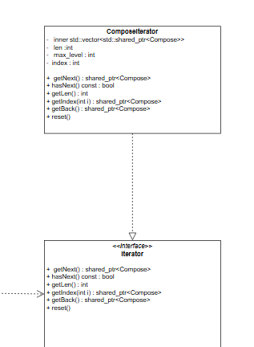
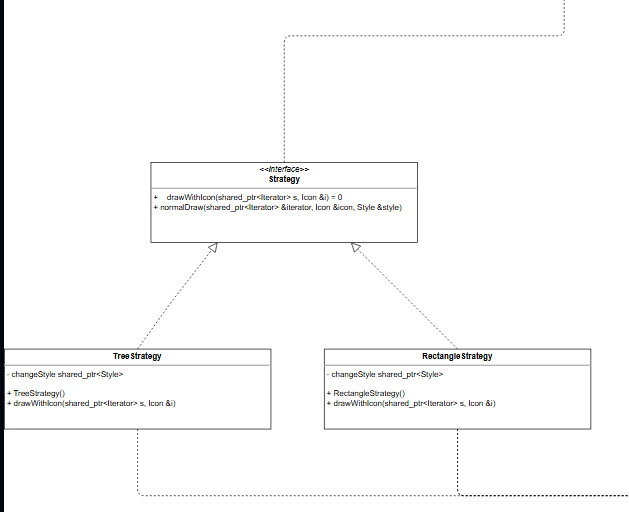
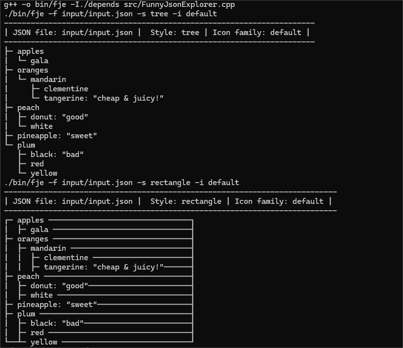
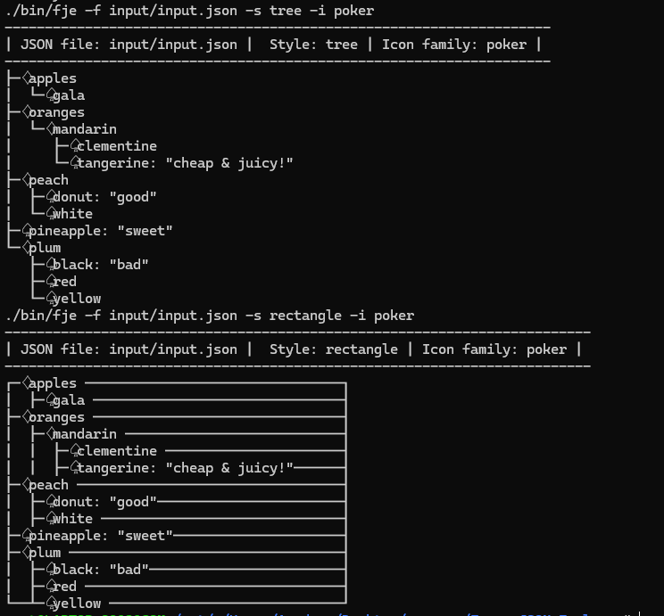

# 软件工程作业-Funny JSON Explorer 进阶

计科（系统结构）21307207 蔡俊彦

## 实验过程

### 运行环境

Ubuntu22.04

### 迭代器模式

- 迭代器模式（Iterator Pattern）是一种常使用的设计模式。它提供一种方法顺序访问一个集合对象中的各个元素，而又无需暴露该对象的内部表示。
- 迭代器模式将迭代逻辑封装到一个独立的对象中，从而与容器的实现分离。这样，容器无论如何变化，迭代器提供的访问方式都保持一致。
- 为了方便程序编写，我加上了重置和访问尾部元素的函数。



### 策略模式

- 策略模式（Strategy Pattern）允许在运行时选择算法或行为的一种方式。
- 在该模式中定义了算法族，分别封装起来，让它们之间可以互相替换。
- 这种模式让算法的变化独立于使用算法的客户。通过该模式，可以根据场景需求，动态地切换算法或行为。
- 我定义了策略接口`drawWithIcon`，只需要迭代器对象和图标对象作为参数传入客户定义的策略就行。



### 迭代器+策略模式的组合

将迭代器模式与策略模式结合起来，可以在迭代过程中灵活地切换不同的迭代算法或行为。在这种组合中：

- **迭代器负责遍历集合中的元素**。迭代器提供一致的遍历接口，使得客户无需了解容器的内部结构就能遍历容器的元素。
- **策略模式提供了不同的迭代算法或行为**。可以根据实际需要，在运行时切换不同的迭代策略，如正序遍历、逆序遍历或者根据某种规则过滤后的遍历等。
- **UML图**：


这种组合增加了迭代过程的灵活性和可扩展性，使得可以根据实际需求选择最适合的迭代方式，从而提高了代码的复用性和维护性。

## 实验结果

### 测试代码

```json
{
  "oranges": {
    "mandarin": {
    "clementine": null,
    "tangerine": "cheap & juicy!"
  }
},
  "apples": {
    "gala": null
  },
  "peach" :{
    "donut": "good",
    "white": null
  },
  "plum": {
    "red": null,
    "black": "bad",
    "yellow": null
  },
  "pineapple": "sweet"
}
```

### 结果截图

2种风格与2种图标混搭




